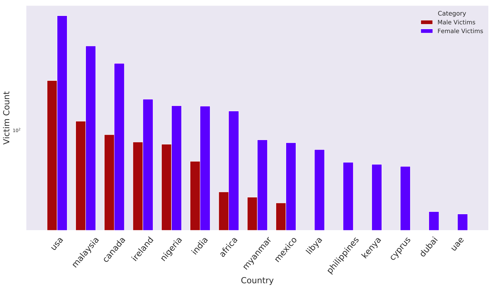
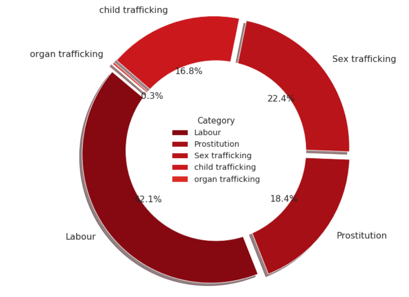
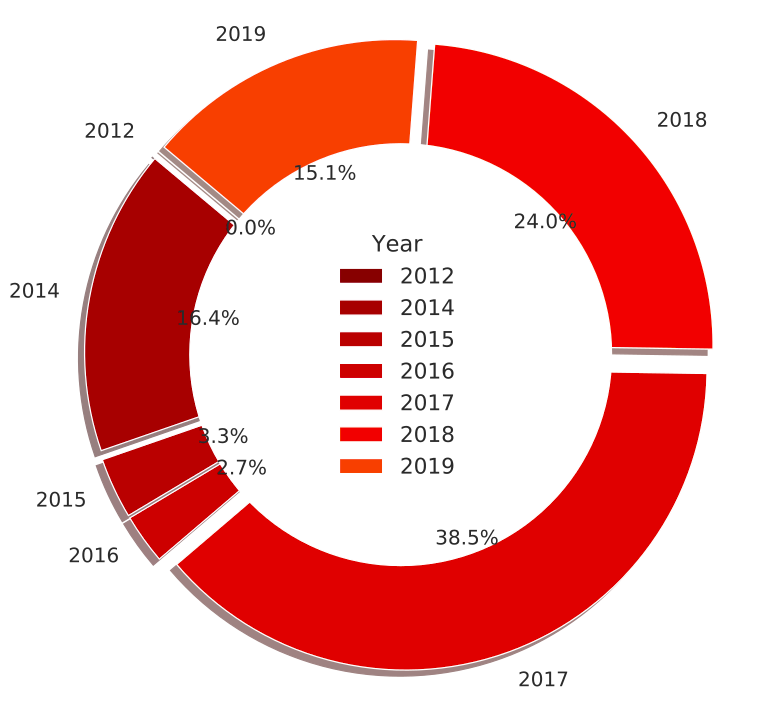
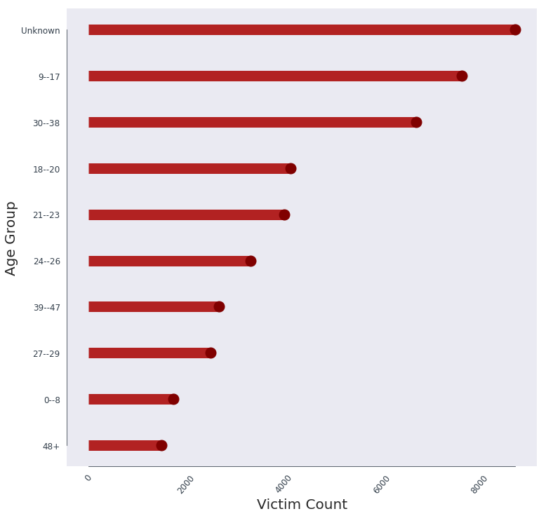
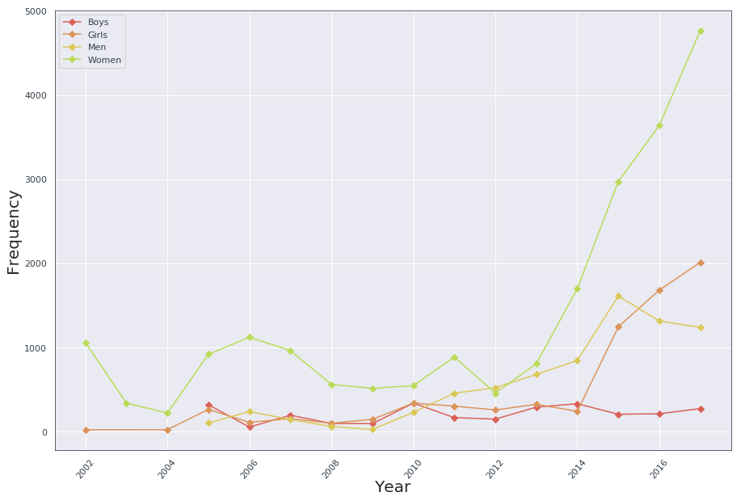
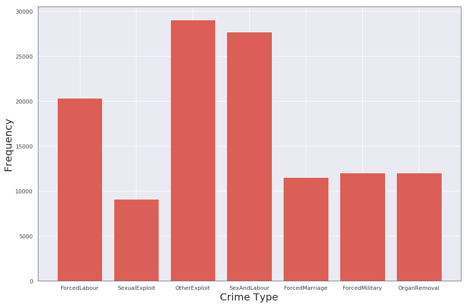
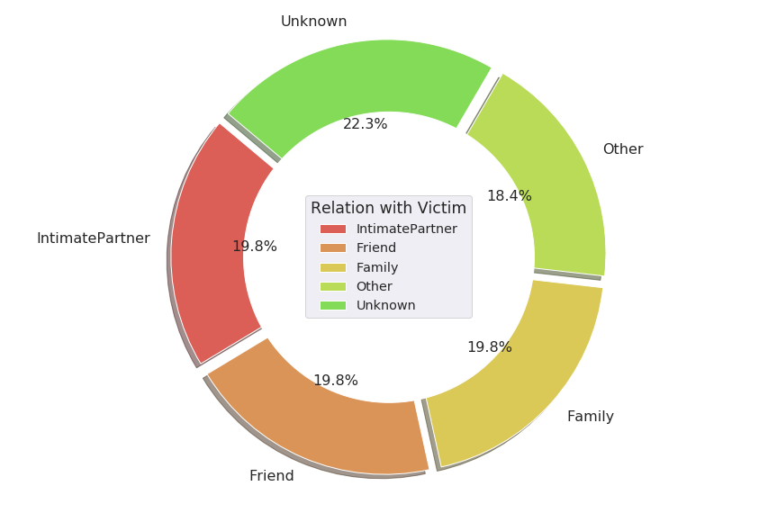

# Human Trafficking dataset creation and analysis

# Introduction
This project was done as a part of the big data & policing course (S19CSE583) at IIIT hyderabad [Blog](https://iiith-cse583-bdp2019.blogspot.com/2019/05/human-trafficking-dataset-creation.html). 
The goal of this project is to create a Human Trafficking dataset from reliable sources such as news articles, Government agencies, etc and analysis the pain points in this area.

# Motivation

## What is human trafficking?
Human trafficking involves recruitment, harbouring or transporting people into a situation of exploitation through the use of violence, deception or coercion and forced to work against their will.
In other words, trafficking is a process of enslaving people, coercing them into a situation with no way out, and exploiting them.

## What is it important?
Did you know that in 2015 alone, Human Trafficking generated `$150 billion`, more revenue  than Google, Nike, The NFL and Starbucks combined?!?! Sounds crazy right? 
Well there is more to this story than you know, that's why 18th of October is the EU Anti-Trafficking Day.
According to a September 2017 report from the International Labor Organization (ILO) and Walk Free Foundation:
1. An estimated 24.9 million victims are trapped in modern-day slavery.
2. Of these, 16 million (64%) were exploited for labor, 4.8 million (19%) were sexually exploited, and 4.1 million (17%) were exploited in state-imposed forced labor.
3. 71% of trafficking victims around the world are women and girls and 29% are men and boys.
4. 15.4 million victims (75%) are aged 18 or older, with the number of children under the age of 18 estimated at 5.5 million (25%).

## Why we choose it as a project?
Initially when we started out to look for dataset on the internet, we were shocked to see although it being such a large scale issue, there was almost no public data available. Most of what was available was proprietary and couldn’t be accessed by students like us.
So, that’s when we decided we will initiate a step towards the creation of a public dataset which when contributed by more people could become a much bigger dataset for others students and people who want to explore this area. 

# Our Work
## Data Collection
1. Manually went through different news articles, and collected relevant information
2. Used https://www.alexa.com/siteinfo to verify the reliability of the resources - articles with country ranking <= 100

## Dataset Statistics
1. Has total of 302 authentic rows collected from over 2000 News articles.
2. Data has been collected from year 2014 - 2019
3. There are 10 columns which include the following:
    - URL
    - Origin of the crime
    - Destination of the crime
    - No. of people involved
    - Ages of the people involved
    - No. of male victims
    - No of female victims
    - Category of the crime
    - Date of the crime
    - City of the crime

## CTDC Dataset
We have also used the dataset available on https://www.ctdatacollaborative.org/ for our analysis. The Counter Trafficking Data Collaborative (CTDC) is the first global data hub on human trafficking, with data contributed by organizations from around the world. 
It has data from 2004-2018. Although it has ~90k cases of data, most of the data was not fit for analysis and hence we had to do extensive cleaning in order to use it for our analysis.

# Analysis of our dataset
## Victim count at gender level 

* Females are highest victims in every country, with USA and Malaysia topping the list. This happens as Sex Trafficking and Prostitution are the major categories in human trafficking

## Victim count at source & destination leve (where from & where to trafficked)

* USA seems to hotspot for trafficking, both as source and destination as all collected data shows the cases are US internal only
* There was one sting operation in italy where about ~1200 victims were saved
* There seem to be high no. of people being trafficked from India to other countries
* Countries like Thailand, Indonesia are hotspots for destination than sourced from. This is because of them being a top choice for holidays, there is a bigger market for prostitution in these countries.

## Crime category distribution

* As expected, Sex Trafficking, Prostitution & Labour seem be the major categories
* The high contribution of labour is also the reason for the high victims in ages 30-40. Young people are lured in the name of employment

## Yearly Victim count distribution

* It is very clear that the no. of crimes have been increasing yearly, which shows that technology still needs to penetrate into this field

# Analysis of the CTDC data set
## Victim count based on age group(2004-2018)

* The age group of the victims is mostly unknown while the cases were reported. However, the analysis also reveals that the age group between 9-17 years is the most targeted indicating children are more susceptible for trafficking.
* People aged 30-38 also have high victims. This is mostly because of bonded labour

## Yearly victim count based on age group 

* Women (age >=18 years) are the most frequent victim of human trafficking and this is closely followed by girls (age <18  years).
* A close look at the plot also reveals that men are also trafficked just as frequently as women, the reason for this is analyzed in the following part. 
* Also, the frequency curve shows the rate of the crime has been ever increasing over the years. This also shows severity and the scale at which human trafficking is done.

## Reason for human trafficking 

* The most common category of human trafficking is Sexual Exploit and Labour. 
* This together constitutes 46.9% of the cases (22.7% sex and labour, 16.7% forced labour and 7.5% sexual exploit).
* This analysis also gives us more insights into why Women and Men are trafficked almost in similar number over all the years. The reason is that women are trafficked for sexual exploits and men are trafficked for bonded and other type of labour.

## Relationship of victim with accused

* Here we look at the relationship of the victim with the accused to find out the reason of how the crime of human trafficking originates and is perpetrated.
* From the analysis we can see that 59.4 % of the victims were closely related to the accused - 19.8 of them were friend, 19.8% were members of the family while other 19.8% were an intimate partner.
* Only for 18.4 % of the cases the accused were not known to the victim.
* The rest of the 22.3 % of the cases could not record the relationship between victim and accused.

# Contributers
1. Praveen Balireddy(praveeniitkgp1994@gmail.com)
2. Aman Joshi(amanjoshi668@gmail.com)
3. Neeraj Barthwal(neeraj.barthwal@gmail.com)
4. Suchismith Roy(suchismith.roy@students.iiit.ac.in)
5. Abhijeet Panda(abhijeet.panda@students.iiit.ac.in) 

